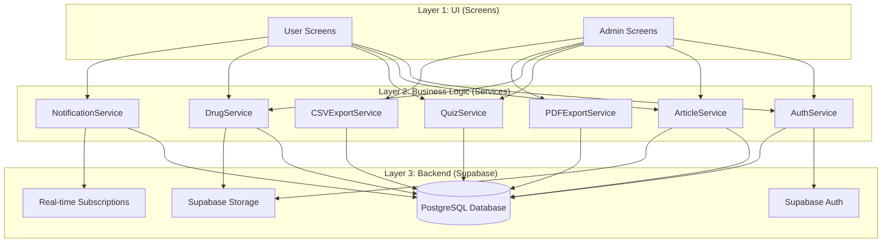
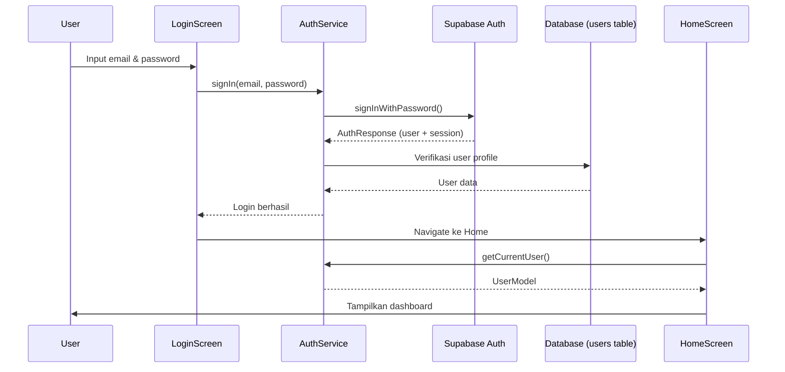
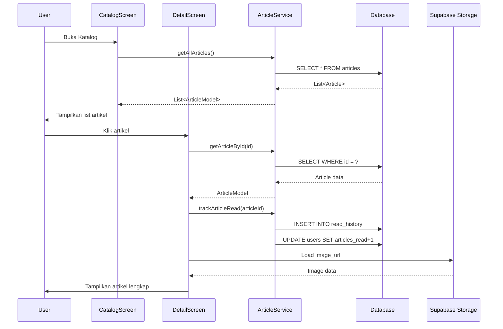
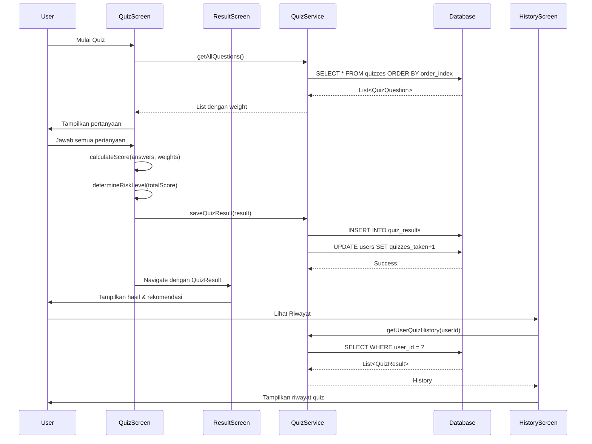
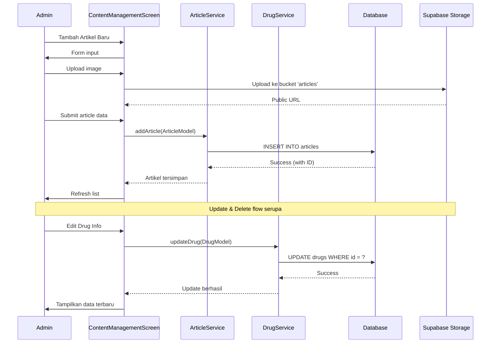
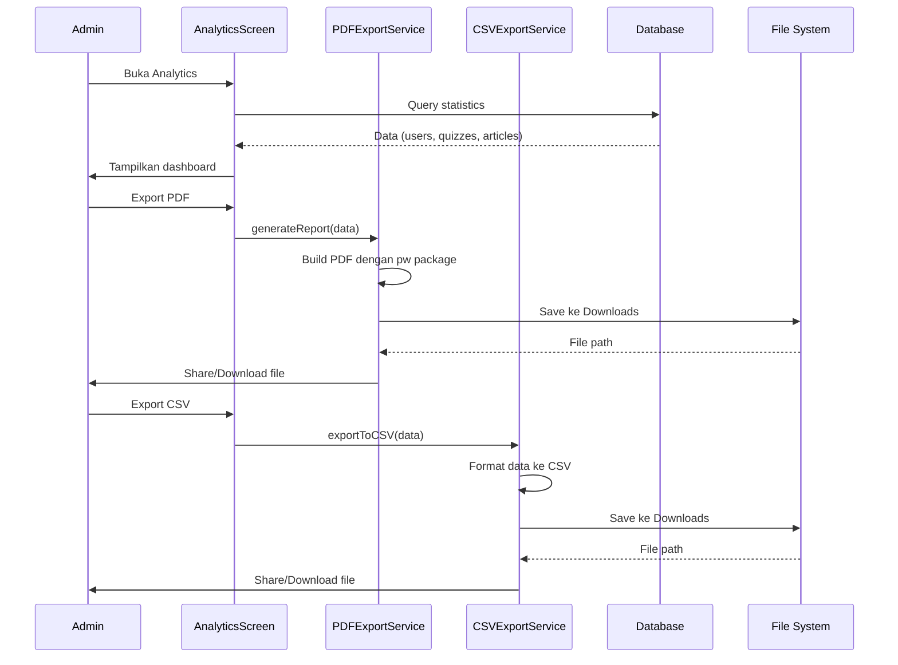
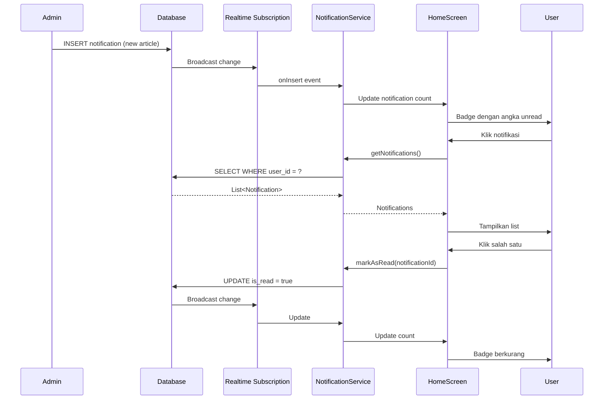
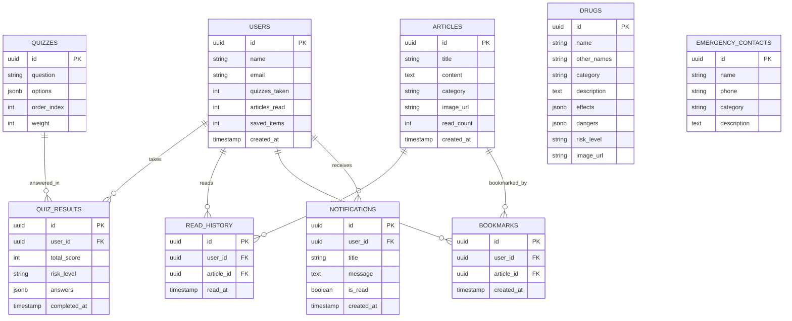
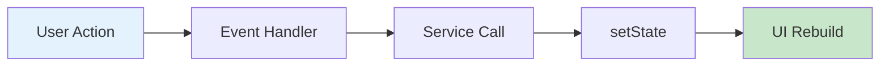

# IDEN - Indeks Risiko & Edukasi Narkotika

Aplikasi mobile edukasi dan assessment risiko penyalahgunaan narkotika berbasis Flutter.

## 🎯 Tujuan Proyek

Menyediakan platform yang reliable untuk:
- Edukasi tentang bahaya narkotika
- Penilaian risiko anonim
- Akses mudah ke pusat bantuan dan rehabilitasi

## ✨ Fitur Utama

### 1. Katalog Informasi Narkotika
- Daftar lengkap jenis-jenis narkotika
- Kategori (Stimulan, Depresan, Halusinogen)
- Informasi detail tentang:
  - Nama lain/street names
  - Efek jangka pendek dan panjang
  - Tanda-tanda penggunaan
  - Tingkat risiko dan kecanduan
  - Langkah-langkah bantuan

### 2. Quiz Penilaian Risiko
- Kuis anonim dengan 5 pertanyaan
- Penilaian berbasis skor
- Hasil dengan visualisasi:
  - Tingkat risiko (Rendah/Sedang/Tinggi)
  - Rincian skor (Frekuensi, Dampak Kesehatan, Ketergantungan)
  - Rekomendasi tindakan

### 3. Pusat Bantuan
- Hotline darurat 24/7
- Informasi pusat rehabilitasi
- Layanan konseling online
- Kelompok dukungan
- Semua layanan bersifat anonim dan rahasia

## 📱 Screens Overview

### User Screens (11 total)
1. **Splash** - Logo loading (100ms)
2. **Onboarding** - 3 slides pengenalan fitur
3. **Login** - Autentikasi user
4. **Register** - Pendaftaran akun
5. **Home** - Dashboard dengan 4 tabs (Beranda, Katalog, Riwayat, Profil)
6. **Catalog** - Daftar narkotika dengan search & filter
7. **Detail** - Info lengkap narkotika (Deskripsi, Efek, Bahaya)
8. **Quiz** - Assessment risiko interaktif
9. **Result** - Hasil quiz dengan visualisasi & rekomendasi
10. **Help Center** - FAQ & kontak darurat
11. **Profile** - Settings & info akun user

### Admin Screens (7 total)
1. **Admin Login** - Autentikasi admin (demo: `admin`/`admin123`)
2. **Dashboard** - Statistik overview (users, articles, quizzes, daily access)
3. **Content Management** - CRUD artikel & katalog narkotika dengan image upload
4. **User Management** - Kelola user (block/unblock, view activity)
5. **Quiz Management** - CRUD quiz questions dengan bobot (0-100)
6. **Emergency Management** - CRUD kontak darurat
7. **Analytics & Reports** - Laporan lengkap dengan export PDF/CSV

## 🎨 Design System

### Color Palette
- **Primary**: Navy `#000080` - Warna utama profesional
- **Accent**: `#D4936D` - Warna tan/coklat untuk highlight
- **Risk Levels**:
  - Rendah: `#4CAF50` (hijau)
  - Sedang: `#FF9800` (orange)
  - Tinggi: `#FF5252` (merah)
  - Ekstrem: `#D32F2F` (merah tua)

### Typography
- Font Family: Roboto
- Headings: Bold 32/24/20/18/16 (h1-h5)
- Body: Regular/Medium 16/14/12

## 🔄 Data Flow Diagram

### Arsitektur Data Aplikasi

Aplikasi ini menggunakan **arsitektur 3-layer** dengan Supabase sebagai backend:



### Flow Data Per Fitur

#### 1️⃣ **Authentication Flow**



**Penjelasan:**
1. User input credentials di `LoginScreen`
2. `LoginScreen` memanggil `AuthService.signIn()`
3. `AuthService` berkomunikasi dengan Supabase Auth untuk autentikasi
4. Jika berhasil, session disimpan otomatis oleh Supabase SDK
5. Data user profile diambil dari tabel `users`
6. User diarahkan ke `HomeScreen` dengan data user

---

#### 2️⃣ **Article Reading Flow**



**Penjelasan:**
1. `CatalogScreen` memuat semua artikel dari database via `ArticleService`
2. User memilih artikel, navigasi ke `DetailScreen`
3. `DetailScreen` memuat detail artikel berdasarkan ID
4. Saat artikel dibuka, tracking otomatis:
   - Simpan ke `read_history` (hanya sekali per artikel per user)
   - Increment counter `articles_read` di tabel `users`
5. Gambar dimuat dari Supabase Storage
6. Konten artikel ditampilkan ke user

---

#### 3️⃣ **Quiz Assessment Flow**



**Penjelasan:**
1. User memulai quiz dari `QuizScreen`
2. Questions dimuat dari database dengan `weight` untuk scoring
3. User menjawab 5 pertanyaan
4. Sistem menghitung:
   - **Total Score**: Sum of (answer_value × question_weight)
   - **Risk Level**: Berdasarkan threshold (Rendah/Sedang/Tinggi)
5. Hasil disimpan ke `quiz_results` table
6. Counter `quizzes_taken` di tabel `users` bertambah
7. Hasil ditampilkan di `ResultScreen` dengan visualisasi
8. User bisa melihat history di `HistoryScreen`

---

#### 4️⃣ **Admin Content Management Flow**



**Penjelasan:**
1. Admin login ke panel admin
2. Untuk menambah artikel:
   - Upload gambar ke Supabase Storage
   - Dapatkan public URL
   - Simpan artikel dengan URL gambar ke database
3. CRUD operations (Create, Read, Update, Delete) untuk:
   - Articles (`articles` table)
   - Drugs (`drugs` table)
   - Quiz Questions (`quizzes` table)
   - Emergency Contacts (`emergency_contacts` table)
4. Semua perubahan langsung tersimpan ke database
5. UI otomatis refresh untuk menampilkan data terbaru

---

#### 5️⃣ **Analytics & Reports Flow**



**Penjelasan:**
1. Admin membuka `AnalyticsScreen`
2. Data statistik dimuat dari berbagai tabel:
   - Total users & active users
   - Quiz attempts & average scores
   - Articles read count
   - Engagement metrics
3. Admin bisa export data dalam 2 format:
   - **PDF**: Report profesional dengan charts dan tabel
   - **CSV**: Data mentah untuk analisis external
4. File disimpan ke Downloads folder
5. User bisa share atau download file

---

#### 6️⃣ **Real-time Notifications Flow**



**Penjelasan:**
1. Admin membuat konten baru (artikel, drug info, dll)
2. System otomatis insert notifikasi ke database
3. **Realtime subscription** mendeteksi perubahan
4. `NotificationService` menerima event dan update UI
5. Badge notifikasi di `HomeScreen` update otomatis
6. User bisa:
   - Lihat semua notifikasi
   - Mark as read (individual atau all)
   - Navigate ke konten terkait
7. Unread count update real-time tanpa refresh

---

### Database Schema Overview



### Teknologi Stack

| Layer | Teknologi | Fungsi |
|-------|-----------|--------|
| **Frontend** | Flutter | UI Framework cross-platform |
| **State Management** | StatefulWidget | Local state untuk screens |
| **Backend** | Supabase | Backend-as-a-Service |
| **Database** | PostgreSQL | Relational database |
| **Authentication** | Supabase Auth | User authentication & session |
| **Storage** | Supabase Storage | Cloud storage untuk images |
| **Real-time** | Supabase Realtime | WebSocket subscriptions |
| **Export** | pdf, csv packages | Generate reports |

### State Management Approach

Aplikasi ini menggunakan **StatefulWidget** (built-in Flutter state management) tanpa library eksternal.

#### Implementasi Pattern

```dart
class HomeScreen extends StatefulWidget {
  @override
  State<HomeScreen> createState() => _HomeScreenState();
}

class _HomeScreenState extends State<HomeScreen> {
  // Local state variables
  bool _isLoading = true;
  List<ArticleModel> _articles = [];
  UserModel? _user;
  int _unreadNotifications = 0;
  
  @override
  void initState() {
    super.initState();
    _loadData();
  }
  
  Future<void> _loadData() async {
    setState(() => _isLoading = true);
    
    // Direct service calls
    final articles = await ArticleService().getAllArticles();
    final user = await AuthService().getCurrentUser();
    
    // Check if widget still mounted before setState
    if (mounted) {
      setState(() {
        _articles = articles;
        _user = user;
        _isLoading = false;
      });
    }
  }
  
  @override
  Widget build(BuildContext context) {
    if (_isLoading) return CircularProgressIndicator();
    return ListView(children: _buildArticleCards());
  }
}
```

#### State Flow



**Contoh konkret:**
```
Tap Article → _onArticleTap() → ArticleService.trackRead() → setState() → build()
```

#### Karakteristik

| Aspek | Detail |
|-------|--------|
| **Pattern** | StatefulWidget + setState() |
| **Scope** | Local (per-screen) |
| **Data Fetching** | Direct service calls di `initState()` |
| **Updates** | `setState()` untuk trigger rebuild |
| **Navigation** | Navigator.push/pop dengan data passing |
| **Session** | Auto-persist via Supabase SDK |
| **Async Safety** | `mounted` check sebelum setState |

#### ✅ Kelebihan

- **Simple & Straightforward**: Tidak perlu setup library eksternal
- **Easy to Learn**: Cocok untuk pemula Flutter
- **Less Boilerplate**: Minimal code overhead
- **Built-in**: Native Flutter, zero dependencies
- **Perfect for Edu**: Ideal untuk project pembelajaran

#### ⚠️ Kekurangan

- **No Global State**: Data harus di-fetch ulang per screen
- **Prop Drilling**: Passing data via constructor parameters
- **Full Rebuilds**: Entire widget tree rebuilds on setState
- **Limited Scalability**: Tidak ideal untuk app sangat kompleks

#### 🔄 Alternative untuk Scaling

Jika aplikasi berkembang lebih besar, consider:

1. **Provider** (recommended): 
   - Simple global state management
   - Minimal learning curve
   - `flutter pub add provider`

2. **Riverpod**: 
   - Modern, compile-safe Provider
   - Better testing support
   - `flutter pub add flutter_riverpod`

3. **Bloc**: 
   - Event-driven architecture
   - Strict separation of concerns
   - `flutter pub add flutter_bloc`

> **Note**: Untuk project scope saat ini (edukasi narkotika dengan ~20 screens), StatefulWidget sudah sangat cukup dan maintainable.

### Data Persistence

1. **Session Management**:
   - Supabase SDK automatically handles session persistence
   - Session stored securely di SharedPreferences
   - Auto-refresh token sebelum expired

2. **Offline Capability**:
   - Saat ini: Online-only (requires internet)
   - Future: Implementasi caching dengan Hive/SQLite

3. **Image Caching**:
   - Images dari Supabase Storage di-cache otomatis oleh Flutter
   - Cache invalidation based on URL changes

### Security Measures

1. **Row Level Security (RLS)** di Supabase:
   - Users hanya bisa read/write data milik sendiri
   - Admin policies untuk content management
   
2. **Authentication**:
   - JWT tokens untuk session
   - Secure password hashing
   - Email verification (optional)

3. **API Security**:
   - Supabase Anon Key untuk public access
   - Service Role Key (tidak ada di client) untuk admin ops

---

## 🏗️ Struktur Folder

```
lib/
├── constants/           # Konstanta global
│   ├── app_colors.dart      # Palet warna (Navy #000080, risk levels)
│   └── app_text_styles.dart # Typography system (h1-h5, body)
│
├── models/             # Data models untuk database
│   ├── user_model.dart       # Model User (id, name, email, stats)
│   ├── drug_model.dart       # Model Drug/Narkotika (name, effects, dangers)
│   ├── article_model.dart    # Model Artikel (title, content, author)
│   └── quiz_model.dart       # Model Quiz & Result (questions, score)
│
├── screens/            # UI Screens
│   ├── onboarding/          # Onboarding flow
│   │   ├── splash_screen.dart       # Splash screen (100ms)
│   │   └── onboarding_screen.dart   # 3 slides pengenalan
│   │
│   ├── auth/               # Authentication
│   │   ├── login_screen.dart        # Login form
│   │   └── register_screen.dart     # Register form
│   │
│   ├── main/               # Main app screens
│   │   ├── home_screen.dart         # Home dengan bottom nav (4 tabs)
│   │   ├── catalog_screen.dart      # List narkotika dengan filter
│   │   ├── detail_screen.dart       # Detail info narkotika
│   │   ├── quiz_screen.dart         # Assessment quiz
│   │   ├── result_screen.dart       # Hasil quiz & rekomendasi
│   │   ├── help_center_screen.dart  # FAQ & kontak darurat
│   │   ├── profile_screen.dart      # Profil & settings user
│   │   └── history_screen.dart      # Riwayat quiz & artikel
│   │
│   └── admin/              # Admin panel
│       ├── admin_login_screen.dart         # Login admin
│       ├── admin_dashboard_screen.dart     # Dashboard statistik
│       ├── content_management_screen.dart  # Kelola artikel & katalog
│       ├── user_management_screen.dart     # Kelola user
│       ├── quiz_management_screen.dart     # Kelola quiz questions
│       └── emergency_management_screen.dart # Kelola kontak darurat
│
├── services/           # Business logic & API
│   ├── auth_service.dart         # Authentication with Supabase
│   ├── article_service.dart      # Article CRUD & read tracking
│   ├── quiz_service.dart         # Quiz management & results
│   ├── pdf_export_service.dart   # PDF generation for reports
│   └── csv_export_service.dart   # CSV export for analytics
│
├── widgets/            # Reusable widgets
│   └── (kosong - untuk custom widgets)
│
├── utils/              # Helper functions
│   └── (kosong - untuk validators, formatters)
│
└── main.dart           # Entry point app
```

## 📦 Models Explained

### Perbedaan Screen vs Model:

- **Screen/View**: UI yang dilihat user (tampilan visual)
- **Model**: Struktur data/objek untuk menyimpan informasi di database

**ANALOGI:**
- Screen = **Formulir kertas** yang kamu lihat
- Model = **Data yang kamu tulis** di formulir (nama, alamat, dll)

### Kapan Model Digunakan:

Model saat ini kosong karena **belum ada database**. Ketika nanti integrasi **Hive** (database lokal), model akan digunakan untuk:

1. **UserModel** - Menyimpan data akun user
   ```dart
   UserModel user = UserModel(
     id: '123',
     name: 'Budi',
     email: 'budi@example.com',
     quizzesTaken: 5,
   );
   ```

2. **DrugModel** - Menyimpan info narkotika
   ```dart
   DrugModel drug = DrugModel(
     id: '1',
     name: 'Ganja',
     riskLevel: 'high',
     effects: ['Halusinasi', 'Euforia'],
   );
   ```

3. **ArticleModel** - Menyimpan artikel edukasi
4. **QuizModel** - Menyimpan pertanyaan & hasil quiz

### Cara Kerja dengan Database:

```dart
// 1. Simpan ke database
await userBox.put(user.id, user.toMap());

// 2. Ambil dari database
Map data = userBox.get('123');
UserModel user = UserModel.fromMap(data);

// 3. Update data
UserModel updated = user.copyWith(quizzesTaken: 6);
await userBox.put(user.id, updated.toMap());
```

## 📝 Dokumentasi Kode

Setiap file sudah dilengkapi dengan **header comment** yang menjelaskan:
- Fungsi file
- Fitur utama
- Dependencies/imports yang dibutuhkan

Contoh:
```dart
/// Login Screen - Layar autentikasi user
/// Form login dengan email & password, validasi input
/// Setelah login berhasil, masuk ke Home Screen
```

```

## 🚀 Cara Menjalankan

1. Pastikan Flutter sudah terinstall
```bash
flutter --version
```

2. Clone/navigasi ke project folder
```bash
cd "d:\Kodingan\Semester 5\projek pem mob\iden_app"
```

3. Install dependencies
```bash
flutter pub get
```

4. Run aplikasi
```bash
flutter run
```

## 🔐 Admin Credentials (Demo)

- **Username**: `admin`
- **Password**: `admin123`

## 📝 Rencana Pengembangan Selanjutnya

### Phase 1: Database Integration (Next)
- [ ] Setup Hive database
  ```yaml
  dependencies:
    hive: ^2.2.3
    hive_flutter: ^1.1.0
  ```
- [ ] Initialize Hive di `main.dart`
  ```dart
  await Hive.initFlutter();
  await Hive.openBox('users');
  await Hive.openBox('drugs');
  await Hive.openBox('articles');
  await Hive.openBox('quizzes');
  ```
- [ ] Create Service layer untuk business logic
  ```dart
  class UserService {
    Box userBox = Hive.box('users');
    
    Future<void> saveUser(UserModel user) async {
      await userBox.put(user.id, user.toMap());
    }
  }
  ```
- [ ] Seed initial data (drugs, articles, quiz questions)

### Phase 2: Advanced Features
- [ ] Search functionality dengan debounce
- [ ] Filter berdasarkan kategori dan risk level
- [ ] Bookmark/save functionality dengan persistent storage
- [ ] History penilaian risiko user
- [ ] Profile management (edit nama, email, photo)

### Phase 3: Enhancement
- [ ] Animasi dan transisi smooth
- [ ] Offline mode (data cached)
- [ ] Push notifikasi untuk reminder
- [ ] Multi-language support (EN/ID)
- [ ] Export hasil quiz ke PDF

## 🎓 Tantangan Pembelajaran

1. **Manajemen Data Hierarkis**: 
   - Kategori → Jenis Narkotika → Detail
   - Menggunakan Hive untuk local storage
   - Relasi antar models (User → Quiz Results)

2. **State Management**:
   - Quiz logic dan scoring algorithm
   - Navigation flow dengan callback pattern
   - User preferences dan session management

3. **UI/UX Design**:
   - Desain yang sensitif dan professional
   - Non-judgmental approach
   - Accessibility considerations
   - Responsive layout untuk berbagai screen size

## 📊 Project Statistics

- **Total Files**: 38+
  - 17 User Screens
  - 7 Admin Screens (Dashboard, Content, Users, Quiz, Emergency, Analytics)
  - 5 Models (User, Drug, Article, Quiz, EmergencyContact)
  - 8 Services (Auth, Article, Quiz, PDF Export, CSV Export, etc.)
  - 2 Constants (Colors, TextStyles)
  - 1 Main entry point
- **Lines of Code**: ~12,000+ LOC
- **Flutter SDK**: 3.9.2+
- **Database**: Supabase (PostgreSQL)
- **Last Updated**: December 8, 2024

## 🆕 Recent Updates (December 2024)

### ✅ Major Features Added

#### 1. **Supabase Backend Integration**
- PostgreSQL database with Row Level Security (RLS)
- Real-time data synchronization
- Secure authentication system
- Cloud storage for images (banners, articles, drugs)

#### 2. **Analytics Dashboard & Reporting**
- 📊 **Real-time Statistics**:
  - Total users & active users
  - Quiz attempts and average scores
  - Articles read tracking
  - Engagement rate metrics
- 📄 **PDF Export**: Professional analytics reports with charts and tables
- 📊 **CSV Export**: Data export for external analysis
- 📈 **Activity Tracking**: User engagement metrics

#### 3. **Home Screen Enhancements**
- 🎨 **Manual Swipe Banner Carousel**:
  - 3 educational banners from Supabase Storage
  - Smooth page transitions
  - Animated dot indicators
  - Responsive image loading
- 📌 **Sticky Header**: Logo and notifications always visible
- ♻️ **Pull-to-Refresh**: Refresh content with swipe gesture

#### 4. **Article Read Tracking**
- ✅ Automatic tracking when users read articles
- 📖 Read history with timestamps
- 📊 Analytics integration (articles_read counter)
- 🔄 Backfill script for existing data

#### 5. **Quiz Management Improvements**
- ⚖️ **Weight System**: Configurable question weights (0-100)
- 🎯 **Flexible Scoring**: Custom weight for better risk assessment
- 🔧 **Admin Controls**: Easy quiz question management
- 📊 **Result Details**: Enhanced quiz result visualization

### 🐛 Bug Fixes & Improvements

#### Database & Backend
- ✅ Fixed `setState` after dispose errors in async functions
- ✅ Added `mounted` checks for all async setState calls
- ✅ Fixed quiz results constraint violations
- ✅ Corrected column name mappings (snake_case vs camelCase)
- ✅ Fixed articles_read counter tracking

#### UI/UX
- ✅ Fixed CORS issues for banner images (moved to Supabase Storage)
- ✅ Improved PDF generation with correct data mapping
- ✅ Enhanced error handling and user feedback
- ✅ Better loading states and error messages

#### Admin Panel
- ✅ Real-time analytics data updates
- ✅ Fixed PDF export formatting
- ✅ Corrected quiz result data display
- ✅ Enhanced user management features

### 🔧 Technical Improvements
- Database migrations for schema updates
- SQL scripts for data backfill and maintenance
- Improved state management with proper lifecycle handling
- Better error logging and debugging information

## 📄 License

Educational project for Mobile Programming course.

## 👥 Contributors

Project Semester 5 - Mobile Programming

---

**Note**: Aplikasi ini dibuat untuk tujuan edukasi dan awareness. Untuk kasus darurat atau konsultasi serius, selalu hubungi profesional kesehatan atau hotline yang tersedia.
